<div align="center">


<br><br>

<a href="https://www.linkedin.com/in/naren007/"></a>
<a href="mailto:narenm0305@gmail.com"></a>
<a href="https://github.com/Naren-M-5"></a>


</div>

---

<div align="center">

## `whoami`

### 3rd-year B.Tech CSBS student at Panimalar Engineering College, Chennai 🇮🇳

I build software and AI-powered systems — turning ideas into working products.  
Currently focused on **AI/ML**, **Software Engineering**, **AI Agents**, **DSA** and **Problem Solving**.

<table>
<tr>
<td align="center" width="25%">
<b>AI/ML</b><br>
<sub>Intelligent systems, agents, automation</sub>
</td>
<td align="center" width="25%">
<b>Software</b><br>
<sub>Web apps, APIs, backend systems</sub>
</td>
<td align="center" width="25%">
<b>Problem Solving</b><br>
<sub>DSA, algorithms, optimization</sub>
</td>
<td align="center" width="25%">
<b>Building</b><br>
<sub>Ideas into shipped products</sub>
</td>
</tr>
</table>

```txt
THINK → BUILD → BREAK → DEBUG → SHIP → REPEAT
```

</div>

---

<div align="center">

## ⚙️ TECH STACK

<p>Tools I use to build, experiment, solve and ship.</p>

### AI / ML


### Software Development


`WEB APPLICATIONS • APIs • BACKEND SYSTEMS`

### Programming


### Databases & Cloud


### Tools


</div>

---

<div align="center">

## 🚀 FEATURED PROJECTS

<p>Selected projects where I turn ideas into working systems.</p>

<table>
<tr>
<td width="50%" valign="top">

### PrepWise AI

AI-powered exam preparation assistant built to make studying sharper, faster and more structured.

`TypeScript` `AI` `Web App` `Vercel`

<a href="https://prep-wise-ai-roan.vercel.app/"></a>
<a href="https://github.com/Naren-M-5/PrepWise-AI"></a>

</td>
<td width="50%" valign="top">

### ArenaFlow AI

Smart fan experience platform using AI and Firebase to improve event and arena engagement.

`React` `Firebase` `Gemini` `AI`

<a href="https://arenaflow-ai.web.app/"></a>
<a href="https://github.com/Naren-M-5/arenaflow-ai"></a>

</td>
</tr>
<tr>
<td width="50%" valign="top">

### AI Career Copilot

Agentic career platform designed to help users plan, improve and move smarter toward their goals.

`AI Agents` `TypeScript` `Career Tech` `Vercel`

<a href="https://ai-career-copilot-iaul-git-main-naren-ms-projects.vercel.app/"></a>
<a href="https://github.com/Naren-M-5/AI-Career-Copilot"></a>

</td>
<td width="50%" valign="top">

### Support Triage Agent

Offline terminal-based support triage system that classifies, routes and prioritizes support issues.

`Python` `Automation` `CLI` `Agentic Workflow`

<a href="https://github.com/Naren-M-5/support-triage-agent"></a>

</td>
</tr>
</table>

</div>

---

<div align="center">

## 🧠 PROBLEM SOLVING

<table>
<tr>
<td width="50%" align="center">

### LeetCode


`DSA` `Algorithms` `Problem Solving`

<sub>Profile link will be added once the exact LeetCode username is confirmed.</sub>

</td>
<td width="50%" align="center">

### Codeforces


`Competitive Programming` `Contests` `Optimization`

<sub>COMING SOON</sub>

</td>
</tr>
</table>

`DSA • ALGORITHMS • PROBLEM SOLVING • OPTIMIZATION`

```txt
SOLVE → LEARN → OPTIMIZE
```

</div>

---

<div align="center">



</div>

---

<div align="center">

## 📊 GITHUB STATS


<br><br>


</div>

---

<div align="center">


</div>
